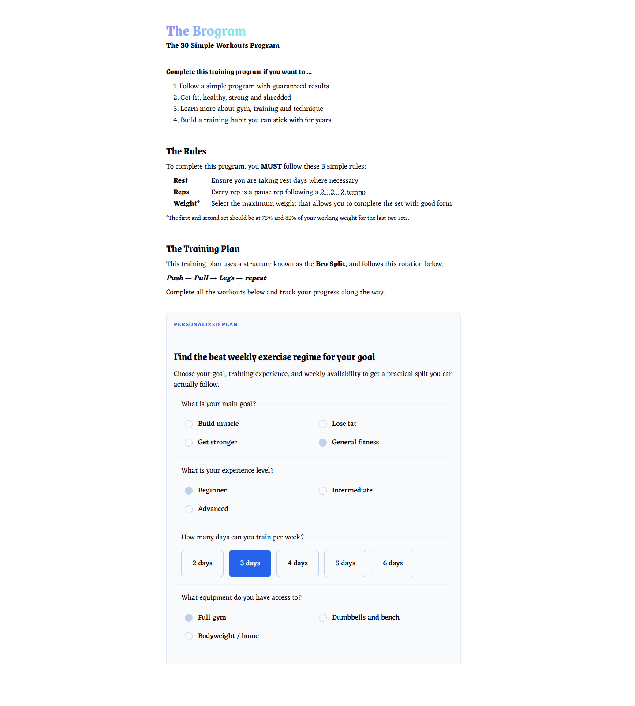
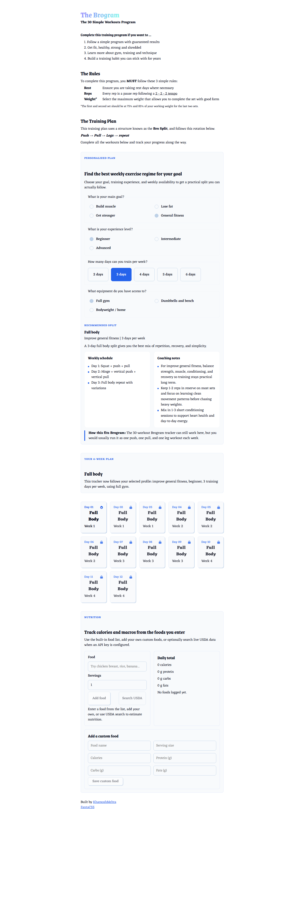

# Brogram

<p align="center">
  A personalized fitness planner built with React and Vite.
</p>

<p align="center">
  
  
  
  
</p>

Brogram is a workout and nutrition app that helps users choose a realistic training split, follow a personalized 4-week plan, and log food intake in the same place.

It began as a simple 30-workout bro split tracker and now supports personalized programming, equipment-aware substitutions, calories, and macro tracking.

## Demo

There is no public deployment linked yet, but you can run the app locally in a few commands:

```bash
npm install
npm run dev
```

Then open the local Vite URL shown in your terminal, usually:

```text
http://localhost:5173
```

## Screenshots

### Personalized planner



### Training plan and nutrition tracking



## Highlights

- Personalized workout planning based on goal, experience, and weekly availability
- Equipment-aware exercise substitutions for `full gym`, `dumbbells`, or `bodyweight/home`
- Progressive workout unlocking and saved exercise weights
- Nutrition logging with calories, protein, carbs, and fats
- Custom foods with user-defined nutrition values
- Optional USDA FoodData Central lookup for fresher nutrition data

## Feature overview

### Personalized training

Users can build a workout plan by selecting:
- a goal: `Build muscle`, `Lose fat`, `Get stronger`, or `General fitness`
- an experience level: `Beginner`, `Intermediate`, or `Advanced`
- weekly training frequency: `2` to `6` days
- available equipment:
  - `Full gym`
  - `Dumbbells and bench`
  - `Bodyweight / home`

The app then generates a 4-week plan using practical split recommendations such as:
- `Full Body`
- `Upper / Lower`
- `Push / Pull / Legs`
- `Conditioning`

### Equipment-based substitutions

If a user does not have access to a full gym, Brogram swaps unsupported exercises automatically and shows a short note explaining the substitution.

Examples:
- `Barbell bench press` -> `Incline dumbbell press` or `Pushups`
- `Lat pull down` -> `Unilateral dumbbell row` or `Wall bodyweight rows`
- `Leg press` -> `Goblet squat` or `Bodyweight squats`

### Workout tracking

- Save working weights for each exercise
- Lock workouts until previous sessions are completed
- Store progress separately for each user profile in `localStorage`

### Nutrition tracking

- Log foods and estimate calories
- Track `protein`, `carbs`, and `fats`
- Save custom foods locally
- Optionally search USDA FoodData Central when an API key is configured

## Tech stack

- `React 19`
- `Vite 6`
- `ESLint 9`
- `FantaCSS`

## Quick start

### Install dependencies

```bash
npm install
```

### Start the app

```bash
npm run dev
```

### Build for production

```bash
npm run build
```

### Preview the production build

```bash
npm run preview
```

## Environment setup

USDA nutrition search is optional.

To enable live food lookup, create a `.env` file in the project root and add:

```env
VITE_USDA_API_KEY=your_usda_fooddata_central_key_here
```

You can copy from `.env.example`.

Without this key, the app still supports:
- the built-in food database
- custom foods
- calorie tracking
- macro tracking

## Scripts

- `npm run dev` starts the Vite development server
- `npm run build` creates the production build
- `npm run lint` runs ESLint
- `npm run preview` previews the production build locally

## Project structure

```text
src/
  components/
    Grid.jsx
    Hero.jsx
    Layout.jsx
    Modal.jsx
    NutritionTracker.jsx
    Planner.jsx
    WorkoutCard.jsx
  utils/
    index.js
    nutrition.js
    planner.js
    programBuilder.js
  App.jsx
  index.css
  main.jsx
```

## Local storage

Brogram currently stores data in the browser:
- workout progress
- user planning profile
- nutrition entries
- custom foods

This keeps setup simple for local development, but it also means data is browser-specific.

## Roadmap ideas

- barcode scanning for packaged foods
- daily calorie and protein targets based on the selected goal
- nutrition history by date
- injury-aware exercise substitutions
- exporting or sharing personalized workout plans
- user accounts and cloud sync

## Notes

- USDA FoodData Central is actively maintained, but not real-time in the strict sense
- built-in foods are useful offline and provide a fallback when no API key is configured
- custom foods let users track meals that are not in the default database
